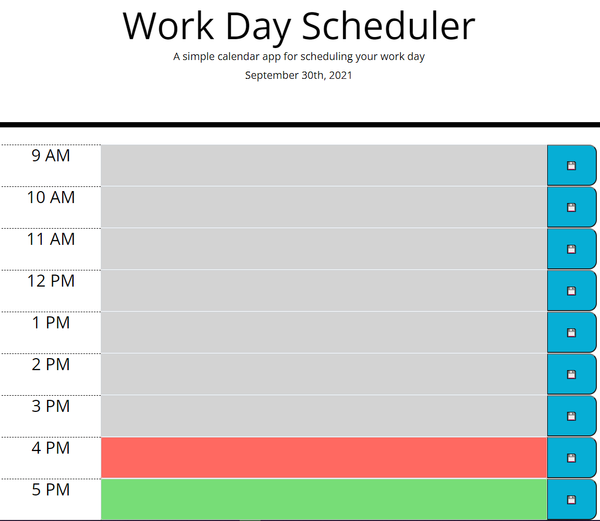

# Day Planner

A day planner that updates with the current time and shows which working hours have passed, which you're in, and which are in the future. This was created as a homework for the UC Berkley Web Development Boot Camp. 

Given an HTML and CSS document with Bootstrap, I created some custom JavaScript that would populate the page with rows for each working hour, containing a lable, text input field, and save button. I then colored each text field based on it's relation to the current time, then allowed the user to save the contents of that field to the local storage using the save button. Finally, I added the current day to the header portion of the site and set the page to update the graphics every second.

## Built With

* [HTML](https://developer.mozilla.org/en-US/docs/Web/HTML)
* [CSS](https://developer.mozilla.org/en-US/docs/Web/CSS)
* [Javascript](https://developer.mozilla.org/en-US/docs/Web/JavaScript)
* [JQuery](https://jquery.com/)
* [Bootstrap](https://getbootstrap.com/)
* [Moment.js](https://momentjs.com/)

## Deployed Link

* [See Live Site](https://adamkruschwitz.github.io/day-planner/)

## Screenshot

## Authors

* Adam Kruschwitz

- [Link to Portfolio Site](https://adamkruschwitz.github.io/Portfolio/)
- [Link to Github](https://github.com/AdamKruschwitz)
- [Link to LinkedIn](https://www.linkedin.com/li/AdamKruschwitz)

See also the list of [contributors](https://github.com/AdamKruschwitz/day-planner/contributors) who participated in this project.

## License

This project is licensed under the MIT License 